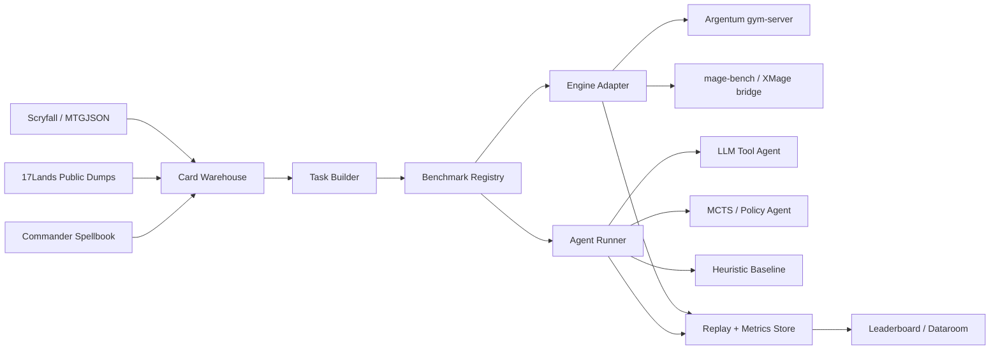

# Implementation Detail

## Product Thesis

Build MTGBench as a layered benchmark and agent lab for Magic: The Gathering:

1. A reproducible local card/data warehouse.
2. One or more rules-engine adapters with legal action masks.
3. A task suite that starts with cheap deterministic subtasks and graduates to full games.
4. Agent runners for LLM-only, LLM+tools, MCTS/search, and learned-policy baselines.
5. A dataroom/leaderboard/replay surface that makes failures inspectable.

## System Shape



## Adapter Contract

Every engine adapter should expose the same contract:

```ts
type EnvId = string;

interface EngineAdapter {
  reset(config: GameConfig): Promise<Observation>;
  observe(envId: EnvId, options?: { revealAll?: boolean; perspective?: number }): Promise<Observation>;
  legalActions(envId: EnvId): Promise<LegalAction[]>;
  step(envId: EnvId, actionId: string | number, payload?: unknown): Promise<Transition>;
  fork?(envId: EnvId, count: number): Promise<EnvId[]>;
  snapshot?(envId: EnvId): Promise<SnapshotHandle>;
  restore?(envId: EnvId, snapshot: SnapshotHandle): Promise<Observation>;
  dispose(envId: EnvId): Promise<void>;
}
```

Argentum already maps cleanly to this with `/envs`, `/envs/{id}`, `/step`, `/fork`, `/snapshot`, and `/restore`.

mage-bench maps less directly because it is a full orchestrator around XMage and MCP tools, but its bridge can become an adapter for full-card evaluations.

## Agent Interfaces

Start with four agent classes:

| Agent | Purpose |
|---|---|
| Random/legal baseline | Sanity floor and invalid-action detector |
| Heuristic baseline | Cheap regression baseline for known board states |
| LLM tool agent | Main user-facing benchmark path: sees state, card text, legal actions, chooses action |
| Search agent | MCTS/rollout agent for labels and strong non-LLM baseline |

The LLM should not emit raw Magic rules operations. It should choose from legal actions and optionally request tools:

| Tool | Input | Output |
|---|---|---|
| `search_cards` | query | matching oracle/card records |
| `get_oracle_text` | card names/ids | exact oracle/ruling text |
| `explain_action` | legal action id | normalized action details |
| `simulate_action` | action id, rollout budget | projected outcomes if adapter supports fork |
| `find_combo_lines` | commander/decklist/cards | Spellbook combo candidates |

## Benchmark Tiers

| Tier | Example | Ground truth |
|---|---|---|
| Card QA | "Which of these cards are legal in Modern?" | Scryfall/MTGJSON |
| Rules QA | "Can this target that?" | Engine microstate |
| Draft pick | "Pick from pack given pool/history" | 17Lands draft logs |
| Combo execution | "Execute this combo line" | Commander Spellbook + engine |
| Tactical state | "Choose best legal action" | Search/rollout/human label |
| Full game | "Play match/Commander pod" | Engine result + replay/blunder analysis |

## Data Store

Use SQLite/DuckDB for the first version:

| Store | Why |
|---|---|
| SQLite | durable app state, task registry, run metadata, source ledger |
| DuckDB/Parquet | large 17Lands/event analytics and feature extraction |
| JSONL | raw run logs and self-play rows |
| Object files | bulk source snapshots, replays, screenshots/videos |

Keep raw source snapshots immutable under a `data/raw/YYYY-MM-DD/source/` shape. Derived tables should be rebuildable.

## First Milestone

Milestone 1 should be intentionally narrow:

1. Ingest Scryfall oracle/default cards and MTGJSON SetList.
2. Ingest Commander Spellbook variants/cards.
3. Wrap Argentum `gym-server` in Python.
4. Define 20 microstate tasks from the cards Argentum already supports.
5. Define 20 combo/card-knowledge tasks not requiring full engine execution.
6. Run random, heuristic, and one LLM model against those tasks.
7. Export JSONL runs plus a Markdown report.

Milestone 2 adds mage-bench/XMage for card coverage and full-game LLM ladders.
